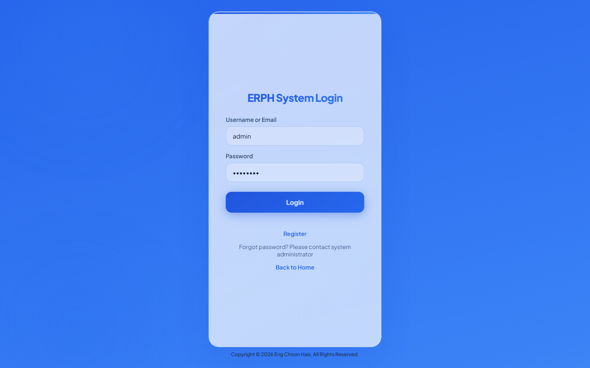
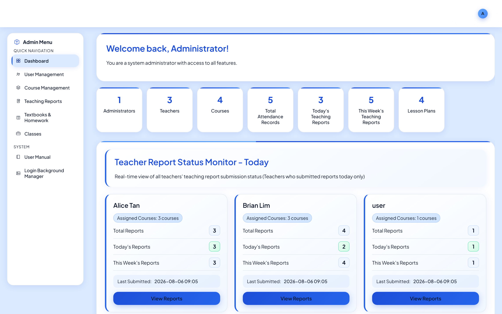
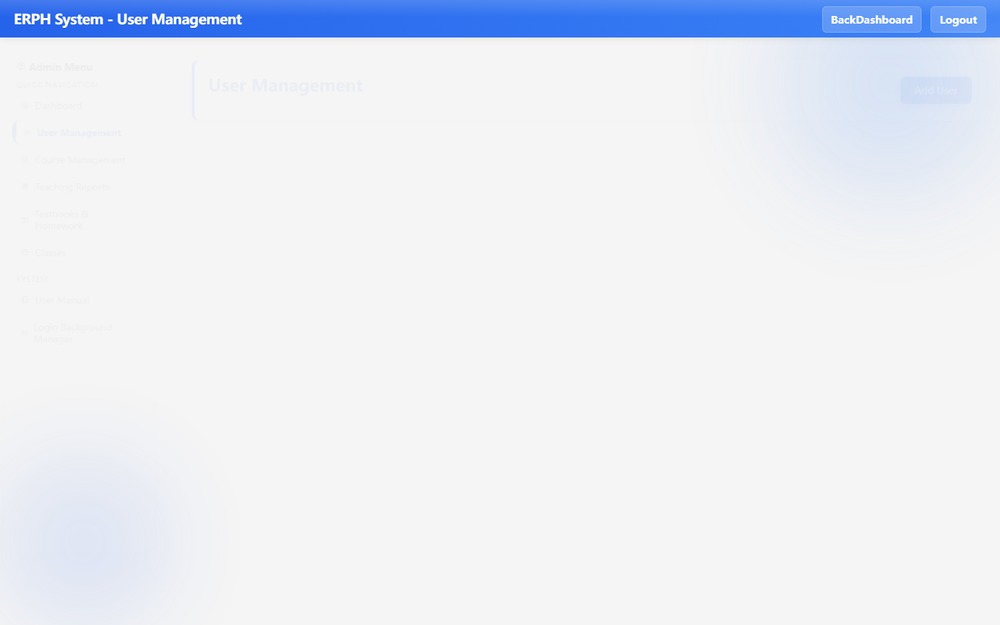
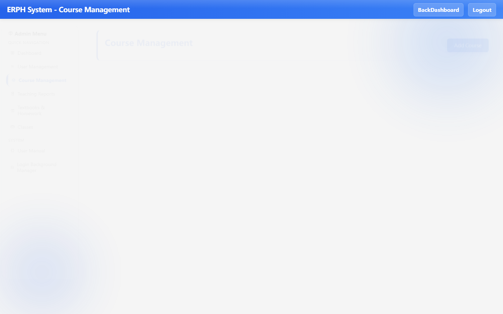
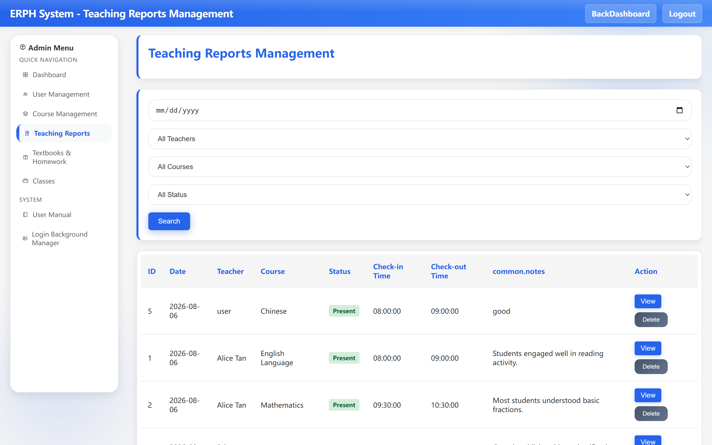
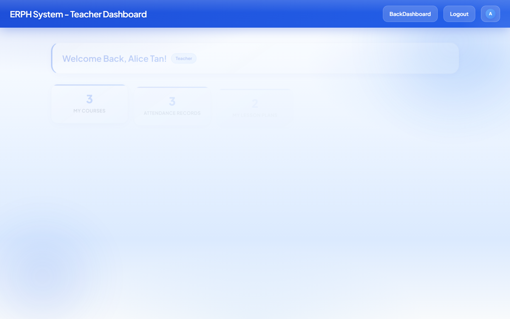

# 🎓 **ERPH System**

A modern **Electronic Resource Planning for Higher education** platform that helps schools manage users, courses, teaching reports, lesson plans, textbooks, and classes — with a clean blue UI for admins and teachers.

<p align="center">
  
  
  
  
</p>

---

## ✨ **Features**

- 🔐 **Role-Based Login**  
  Secure authentication for **Administrators** and **Teachers** with protected dashboards.

- 👥 **User Management**  
  Create, edit, and manage staff accounts with clear role control.

- 📚 **Course Management**  
  Build courses, assign teachers, and keep course catalogs organized.

- 📝 **Teaching Reports**  
  Track daily teaching activity, attendance status, and classroom notes.

- 📖 **Lesson Plans**  
  Plan lessons with course, subject, class, date, and time details.

- 🏫 **Classes & Textbooks**  
  Maintain classes and textbook/homework subjects linked to courses.

- 🎨 **Login Background Manager**  
  Customize the login page look with presets or uploaded images.

- 📘 **Built-in User Manual**  
  Step-by-step in-app guide so new users can learn the system quickly.

---

## 🧰 **Tech Stack**

| **Category** | **Technology** |
|---|---|
| 🖥️ **Frontend** | HTML5, CSS3, JavaScript |
| ⚙️ **Backend** | PHP 7.4+ |
| 🗄️ **Database** | MySQL / MariaDB |
| 🌐 **Server** | Apache (XAMPP / cPanel friendly) |
| 🔒 **Auth** | PHP sessions + password hashing |
| 🎨 **UI** | Custom design system (blue / glass style) |

---

## 🎬 **Project Video**

🎥 Watch the ERPH System demo video on Google Drive:

👉 **[Open Video Demo](https://drive.google.com/file/d/1HfUXT0iRp97tyrfkdXTDr6U6Szdxz_uG/view?usp=sharing)**

<p align="center">
  <a href="https://drive.google.com/file/d/1HfUXT0iRp97tyrfkdXTDr6U6Szdxz_uG/view?usp=sharing">
    
  </a>
</p>

---

## 🚀 **Quick Start**

### 1️⃣ Requirements
- PHP 7.4+
- MySQL 5.7+ or MariaDB 10.2+
- Apache (XAMPP recommended for local use)

### 2️⃣ Setup database
```bash
# Fresh install (recommended)
mysql -u root < sql/erph1_fresh.sql

# Optional: seed demo teachers, courses, classes, reports
mysql -u root < seed_basic_data.sql
```

### 3️⃣ Configure
`config.php` already points to database `erph1` with user `root` (empty password for local XAMPP).  
Override with `config.local.php` on production if needed.

### 4️⃣ Run
Place the project under your web root (e.g. `htdocs/erph system`) and open:

```text
http://localhost/erph%20system/public/login_roles.php
```

### 5️⃣ Default accounts
| Role | Email | Password |
|---|---|---|
| 👑 Admin | `admin@erph.com` | `admin123` |
| 👩‍🏫 Teacher | `teacher1@erph.com` | `teacher123` |
| 👨‍🏫 Teacher | `teacher2@erph.com` | `teacher123` |

> ⚠️ Change default passwords after first login.

---

## 🗂️ **Project Structure**

```text
erph-system/
├── config.php              # App & database settings
├── db.php                  # PDO connection
├── seed_basic_data.sql     # Demo content seed
├── sql/                    # Fresh install schema scripts
├── docs/screenshots/       # README screenshots
├── public/                 # Web root
│   ├── login_roles.php
│   ├── admin_dashboard.php
│   ├── teacher_dashboard.php
│   ├── user_manual.php
│   ├── assets/css/
│   └── inc/                # Bootstrap, translations, glyphs
├── CONTRIBUTING.md
├── LICENSE
└── README.md
```

---

## 📸 **Project Screenshots**

<table>
  <tr>
    <td align="center">
      <br/>
      <b>🔐 Login</b>
    </td>
    <td align="center">
      <br/>
      <b>📊 Admin Dashboard</b>
    </td>
  </tr>
  <tr>
    <td align="center">
      <br/>
      <b>👥 User Management</b>
    </td>
    <td align="center">
      <br/>
      <b>📚 Course Management</b>
    </td>
  </tr>
  <tr>
    <td align="center">
      <br/>
      <b>📝 Teaching Reports</b>
    </td>
    <td align="center">
      <br/>
      <b>👩‍🏫 Teacher Dashboard</b>
    </td>
  </tr>
  <tr>
    <td align="center" colspan="2">
      <br/>
      <b>📘 User Manual</b>
    </td>
  </tr>
</table>

---

## 🤝 **Contributing**

Contributions are welcome!  
Please read **[CONTRIBUTING.md](CONTRIBUTING.md)** for guidelines on issues, pull requests, and coding style.

---

## 📄 **License**

This project is licensed under the **MIT License**.  
See the **[LICENSE](LICENSE)** file for details.

---

## 🙌 **Acknowledgements**

- Built for school / higher-education teaching workflows  
- UI inspired by modern glass / blue dashboard patterns  

✅ Feel free to explore, contribute, and improve the project! 🚀  

⭐ If this project helps you, please **star** the repository!
